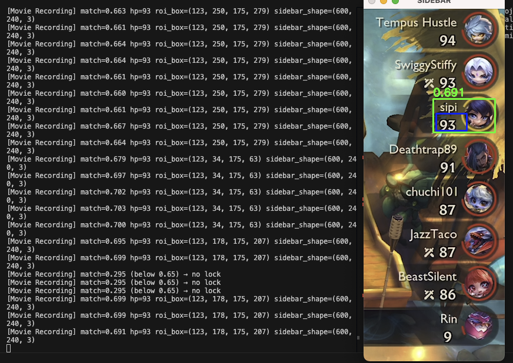

# TFT → Treadmill Controller 🏃‍♂️🎮

> **Live gameplay-driven treadmill control using computer vision**
>
> *Screenshots below show the real-time sidebar detection, HP tracking, and treadmill state overlay.*

## Screenshots

_Add screenshots here once pushed to Git._

```text
docs/screenshots/
├── sidebar_match.png        # Sidebar with match box + HP ROI
├── sidebar_panel.png        # Extended sidebar with stats panel
├── treadmill_overlay.png   # HP → speed/incline mapping
```

Example usage:
```md


```

---

This project connects **Teamfight Tactics gameplay** to a **walking treadmill** in real time.

Your TFT performance directly affects treadmill difficulty:
- Doing well → slower speed / lower incline
- Losing → faster speed / higher incline

The system **does not interact with game memory** (anti-cheat safe).
Instead, it:
1. Mirrors an iPad running TFT via **QuickTime**
2. Uses **computer vision + OCR** to read your HP from the screen
3. Smooths noisy readings for safety
4. Sends **rate-limited commands** to a local treadmill API

---

## High-Level Architecture

```
iPad (TFT)
   ↓  (USB screen mirror)
QuickTime Player (macOS)
   ↓  (screen capture)
Python (OpenCV + OCR)
   ↓  (smoothed HP signal)
Local Treadmill API
   ↓
Walkpad / Treadmill
```

---

## Why This Exists

- TFT has no public API
- Anti-cheat prevents memory inspection
- Player ordering changes dynamically
- HP UI disappears on some screens
- Player portrait appearance changes as HP drops

Design choices reflect these constraints:
- Template matching instead of pure OCR
- Edge-based matching to tolerate UI changes
- HP hold-last behavior when UI is hidden
- Majority-vote smoothing to prevent OCR spikes

This intentionally favors **stability and safety** over instant reaction.

---

## Safety Notes ⚠️

- Start with conservative max speed/incline
- Keep a hand near the treadmill controls
- Use the physical emergency stop if needed
- This is an experimental project — use at your own risk

---

## Disclaimer

This project is for **personal experimentation** only.
It is not affiliated with Riot Games.
No game memory or network traffic is inspected.
